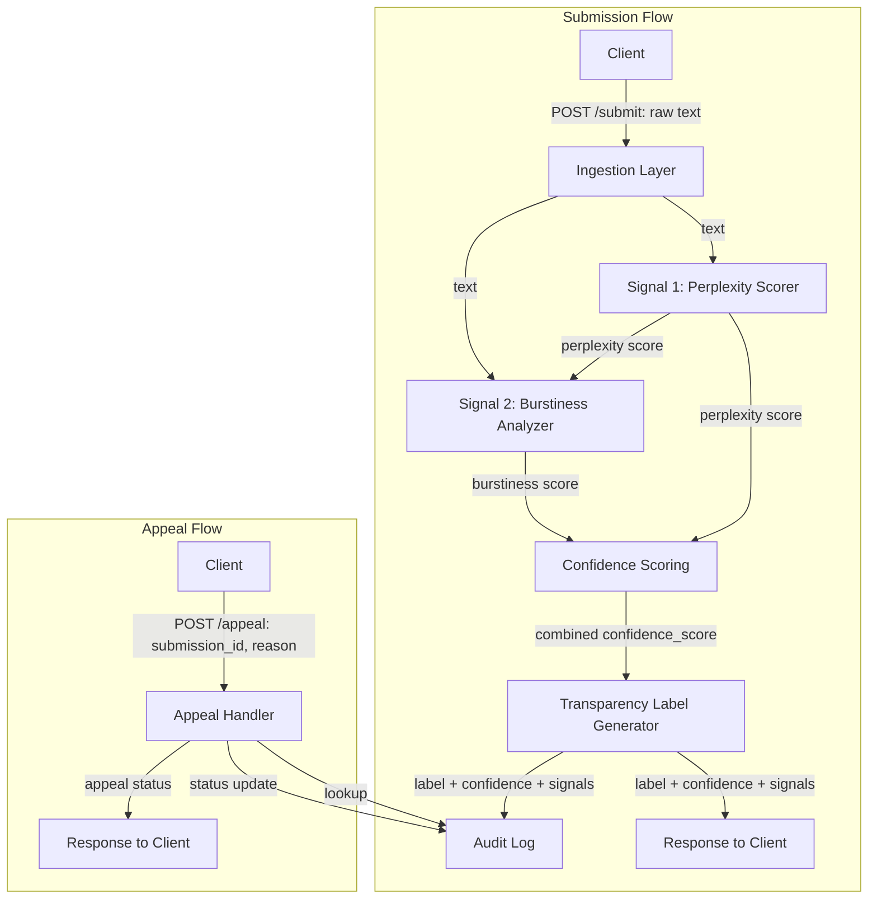

# Provenance Guard — Milestone 1: Architecture Plan

## 1. Architecture Narrative

This is the path a single piece of submitted text takes from arrival to the label a user sees.

1. **Client** sends the raw text to the API via `POST /submit`.
2. **Ingestion layer** validates the payload (non-empty, under max length, supported language) and assigns a `submission_id`.
3. **Signal 1: Perplexity Scorer** runs the text through a reference language model and computes how statistically predictable the word choices are. It outputs a raw score (e.g. average log-probability per token).
4. **Signal 2: Burstiness Analyzer** measures sentence-length and syntactic variance across the text. It outputs a raw score (e.g. coefficient of variation of sentence length).
5. **Confidence Scoring component** normalizes both raw signal scores to a common 0–1 scale and combines them (weighted average) into a single `confidence_score`, representing the system's confidence that the text is AI-generated.
6. **Transparency Label Generator** maps the confidence score to a human-readable label (e.g. "Likely Human," "Uncertain," "Likely AI-Assisted," "Likely AI-Generated") and attaches the underlying signal breakdown so the label is explainable, not just a verdict.
7. **Audit Log component** writes an immutable record: submission_id, timestamp, raw signal scores, combined confidence, and final label.
8. **Response** is returned to the client: `submission_id`, `label`, `confidence_score`, and a breakdown of both signals.

If the creator disputes the label, they call `POST /appeal` with the `submission_id` and their reasoning. The **Appeal Handler** looks up the original submission, updates its status (e.g. "Under Review" → "Resolved"), and writes a new entry to the same audit log tied to the original `submission_id`, preserving the full history. The response confirms the appeal was received and its current status.

**Components touched, end to end:** Client → Ingestion Layer → Signal 1 (Perplexity Scorer) → Signal 2 (Burstiness Analyzer) → Confidence Scoring → Transparency Label Generator → Audit Log → Response. Appeals touch: Client → Appeal Handler → Audit Log (append) → Response.

---

## 2. Detection Signals

### Signal 1: Perplexity (predictability under a reference language model)

- **What it measures:** How statistically "expected" each word is, given the words before it, according to a language model. Low perplexity = very predictable text; high perplexity = more surprising word choices.
- **Why it differs human vs. AI:** AI text generation is explicitly optimized to pick high-probability continuations, so generated text tends to cluster at low perplexity. Human writing tends to include idiosyncratic phrasing, tangents, and less "optimal" word choices, pushing perplexity higher.
- **Blind spot:** Human writers with a plain, formulaic, or highly technical style (legal boilerplate, simple non-native-speaker prose, children's writing) can also score as low-perplexity, causing false positives. Conversely, AI text that has been heavily human-edited or generated with high "temperature" can score higher and evade detection.

### Signal 2: Burstiness (sentence-level structural variance)

- **What it measures:** The variation in sentence length and syntactic structure across a document — how "bursty" or uneven the rhythm of the writing is.
- **Why it differs human vs. AI:** Human writing naturally oscillates between short and long sentences, fragments, and structural styles. AI-generated text tends to produce more uniform sentence lengths and repetitive structural patterns unless explicitly prompted otherwise.
- **Blind spot:** Short-form or highly structured human writing (technical documentation, academic abstracts, news ledes) is naturally low-burstiness and can be misflagged. AI text prompted with instructions like "vary sentence length" or lightly rewritten by a human can mimic natural burstiness and evade detection.

**Why two signals instead of one:** each signal's blind spot is roughly the *opposite* case where the other signal's blind spot occurs (formulaic human writing vs. stylistically-instructed AI text), so combining them into a single confidence score is more robust than relying on either alone — though neither eliminates false positives entirely, which is why the confidence score and appeal path both exist.

---

## 3. False Positive Scenario Walkthrough

**Scenario:** A non-native English speaker writes a technical status report. Their sentences are short, uniform in length, and use predictable, plain vocabulary — a writing style that happens to overlap with both signals' AI-like patterns.

1. Signal 1 (perplexity) returns a low score → looks AI-like.
2. Signal 2 (burstiness) returns a low score → also looks AI-like.
3. Confidence Scoring combines these into a moderately high `confidence_score` (e.g. 0.72) — high, but not maximal, since both signals are individually weak indicators, not proof.
4. Transparency Label Generator assigns "Likely AI-Assisted" rather than "Likely AI-Generated," and — critically — surfaces the signal breakdown and the confidence score itself, not just a flat verdict. The label is designed to communicate *uncertainty*, not a definitive accusation.
5. Audit Log records the full basis for the decision (both raw scores, the combination, and the label).
6. The creator sees the label, disagrees, and calls `POST /appeal` with an explanation (e.g. "I'm a non-native speaker; this is my normal writing style," possibly with supporting samples of their prior writing).
7. Appeal Handler updates the submission's status to "Under Review," and — depending on scope — either flags it for human review or reruns scoring with the additional context. The outcome (e.g. label revised to "Uncertain" or upheld) is appended to the audit log against the original `submission_id`.
8. The response to the appeal includes the updated status and a note on how to check it again (`GET /appeal/{id}`).

**Design implication carried into Milestone 2:** the confidence score must always be shown alongside the label (never a bare true/false verdict), and the appeal flow must preserve — not overwrite — the original decision in the audit log, so the full history is inspectable.

---

## 4. API Surface (sketch)

| Endpoint | Accepts | Returns |
|---|---|---|
| `POST /submit` | `{ text: string, author_id?: string }` | `{ submission_id, label, confidence_score, signals: { perplexity, burstiness } }` |
| `GET /submission/{submission_id}` | — | `{ submission_id, label, confidence_score, signals, status, created_at }` |
| `POST /appeal` | `{ submission_id: string, reason: string, evidence?: string }` | `{ appeal_id, submission_id, status: "under_review", created_at }` |
| `GET /appeal/{appeal_id}` | — | `{ appeal_id, submission_id, status, resolution?, resolved_at? }` |
| `GET /audit-log/{submission_id}` | — | `{ submission_id, entries: [ { event_type, timestamp, data } ] }` |

This is the contract every other component is built against — signal implementations, scoring logic, and storage can all change internally as long as they honor these shapes.

---

## 5. Diagram

**Arrow labels, spelled out:**
- Client → Ingestion Layer: raw submitted text
- Ingestion Layer → Signal 1 / Signal 2: cleaned/validated text
- Signal 1 / Signal 2 → Confidence Scoring: individual raw signal scores
- Confidence Scoring → Label Generator: combined `confidence_score`
- Label Generator → Audit Log: full decision record (label + confidence + signal breakdown)
- Label Generator → Response: label + confidence + signal breakdown
- Client → Appeal Handler: `submission_id` + appeal reason
- Appeal Handler → Audit Log: lookup of original record, then a new appended status-update entry
- Appeal Handler → Response: current appeal status

---

## Checkpoint Self-Check

- ✅ Can describe the path a submitted text takes end to end, naming every component (Section 1).
- ✅ Two detection signals chosen, each with what it captures and what it misses (Section 2).
- ✅ Rough API endpoint list defined (Section 4).
- ✅ Diagram showing both submission and appeal flows, with labeled arrows (Section 5).